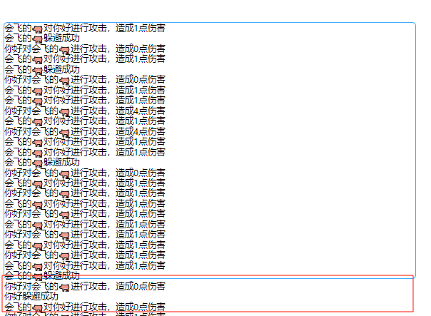

# 开发计划

## 2024-10-5
1、补充装备的属性信息

## 2024-10-4
1、完成人物装备信息，完成装备popover展示信息
2、完成人物装备事件，调整每一个修仙者 一个背包
3、完成装备卸载、穿戴交互事件
4、完成装备拥有基本属性信息
5、完成装备对比信息，属性高的表明↑(绿色)，属性低表明↓(红色)

修复bug：
1. 战斗胜利后，没有取消按钮问题（用Modal.confirm解决）

## 2024-10-3

1、完成保存和载入功能
解决问题：
1. 载入时，节点对象没有生效问题
2. 载入后，无法继续战斗问题

## 2024-10-1

### 添加人物更多属性

防御，造成的伤害＝攻击力-防御力  最小为0
韧性=防御

暴击率，造成的最终伤害的暴击率。
爆发*0.01=暴击率

暴击伤害，暴击后额外的伤害加成
爆伤=暴击伤害

命中，命中率判断 攻击命中率/（攻击命中率+防御躲避率）
命中=命中

躲避=躲避

如果说两个人的躲避值一直都是 躲避成功，那么将进行死循环
解决死路：如果躲避成功则躲避计数器++，反则失败躲避计算器归0。命中计算时加上对方躲避计数器的值

### 修复问题

1、日志框存在问题

### 遗留问题

1、如果日志超过一定行数，则进行丢弃，类似固定队列数组一样

2、日志如何自动往下滚动呢？

3、背包物品存在超格子的问题

4、战斗结束后，没有取消按钮，只能一直继续

5、躲避成功概率过高了，想办法优化一下

### 计划

1、装备系统开发

* 装备的属性如何设计呢？

* 装备如何生成呢？
  * 通过打怪掉落，宝箱开启，商店购买等
* 待开发装备对比信息，属性高的表明↑(绿色)，属性低表明↓(红色)

* 敌人的装备有如何设计呢？什么难度应该装备什么东西呢？
* 装备对象设计
  * 每一个类别是一个类，type为类型（修仙者对象的属性名对应，方便通过['xxx']来进行获取）
  * 目前设计只有武器类、坐骑类、装备类、装备类应该再打开（或者没有装备改为上装类、下装类等）

2、战斗额外场景

* 恢复场景，进行恢复

3、数据保存和载入

* 数据加密存储

4、自定义random_chinese_fantasy_names，能够自定义更多东西